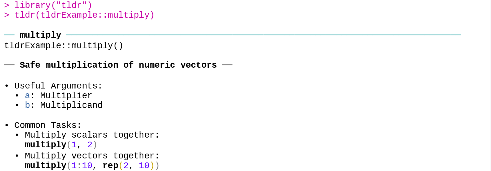

<!-- README.md is generated from README.Rmd. Please edit that file -->

```{r, include = FALSE}
knitr::opts_chunk$set(
  collapse = FALSE,
  comment = "",
  fig.path = "man/figures/README-",
  out.width = "100%"
)

```

# tldrExample

<!-- badges: start -->
<!-- badges: end -->

**tldrExample** exports several simple functions (`multiply()`, `divide()`, ...) with 
<a href = "https://github.com/jamesotto852/tldr">**tldr**</a>-style documentation:



***

Looking at `/R/multiply.R`, we can see how <a href = "https://github.com/jamesotto852/tldr">**tldr**</a>
documentation files are created:

```{r echo = FALSE, comment="", class.output = "r"}
readLines(here::here("R/multiply.R")) |>
  cat(sep = "\n")
```

`tldr_roclet()` from <a href = "https://github.com/jamesotto852/tldr">**tldr**</a> 
creates .Rd files based on relevant tags in the Roxygen skeleton (including the new `@paramtldr` and `@exampletldr`).
These .Rd files are written to the `/inst/tldr/` directory.
Once the package is installed, `tldr:::tldr_help()` and `tldr:::tldr_package()`
are able to find the relevant files which are turned into console output by `tldr:::Rd2tldr()`.

This process is inspired by the `help()` function---for those who are interested, I have a 
<a href="https://jamesotto852.github.io/posts/Understanding-base-documentation-functions">blog post</a>
in which I go through how `?` and `help()` work in detail.

## Installation

<a href = "https://github.com/jamesotto852/tldr">**tldr**</a> and **tldrExample**
are both in very early stages and are not suitable for use as tools by R users and developers.
That being said, if you are interested in installing them you can install the development versions from <a href="https://github.com">GitHub</a> with:
``` r
# install.packages("devtools")
devtools::install_github("jamesotto852/tldr")
devtools::install_github("jamesotto852/tldrExample")
```

