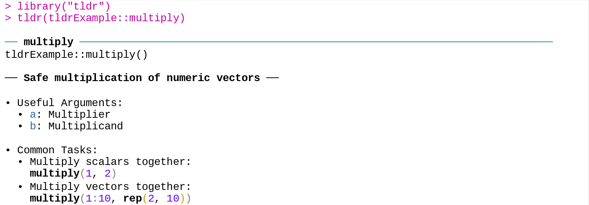

<!-- README.md is generated from README.Rmd. Please edit that file -->

# tldrExample

<!-- badges: start -->
<!-- badges: end -->

**tldrExample** exports several simple functions (`multiply()`,
`divide()`, …) with
<a href = "https://github.com/jamesotto852/tldr">**tldr**</a> -style
documentation:



------------------------------------------------------------------------

Looking at `/R/multiply.R`, we can see how
<a href = "https://github.com/jamesotto852/tldr">**tldr**</a>
documentation files are created:

``` r
#' Safe multiplication of numeric vectors
#'
#' @param a First element to be multiplied
#' @param b Second element to be multiplied
#' @paramtldr a Multiplier
#' @paramtldr b Multiplicand
#'
#' @return A numeric vector
#' @export
#'
#' @exampletldr Multiply scalars together:
#' \code{multiply(1, 2)}
#'
#' @exampletldr Multiply vectors together:
#' \code{multiply(1:10, rep(2, 10))}
#'
#' @examples
#' multiply(1, 2)
#' multiply(1:10, rep(2, 10))
multiply <- function(a, b) {
  if (!is.numeric(a)) stop("a must be numeric")
  if (!is.numeric(b)) stop("b must be numeric")
  if (length(a) != length(b)) stop("a and b must be vectors of the same length")

  a * b
}
```

`tldr_roclet()` from
<a href = "https://github.com/jamesotto852/tldr">**tldr**</a> creates
.Rd files based on relevant tags in the Roxygen skeleton (including the
new `@paramtldr` and `@exampletldr`). These .Rd files are written to the
`/inst/tldr/` directory. Once the package is installed,
`tldr:::tldr_help()` and `tldr:::tldr_package()` are able to find the
relevant files which are turned into console output by
`tldr:::Rd2tldr()`.

This process is inspired by the `help()` function—for those who are
interested, I have a
<a href="https://jamesotto852.github.io/Understanding-base-documentation-functions">blog
post</a> in which I go through how `?` and `help()` work in detail.

## Installation

<a href = "https://github.com/jamesotto852/tldr">**tldr**</a> and
**tldrExample** are both in very early stages and are not suitable for
use as tools by R users and developers. That being said, if you are
interested in installing them you can install the development versions
from <a href="https://github.com">GitHub</a> with:

``` r
# install.packages("devtools")
devtools::install_github("jamesotto852/tldr")
devtools::install_github("jamesotto852/tldrExample")
```
